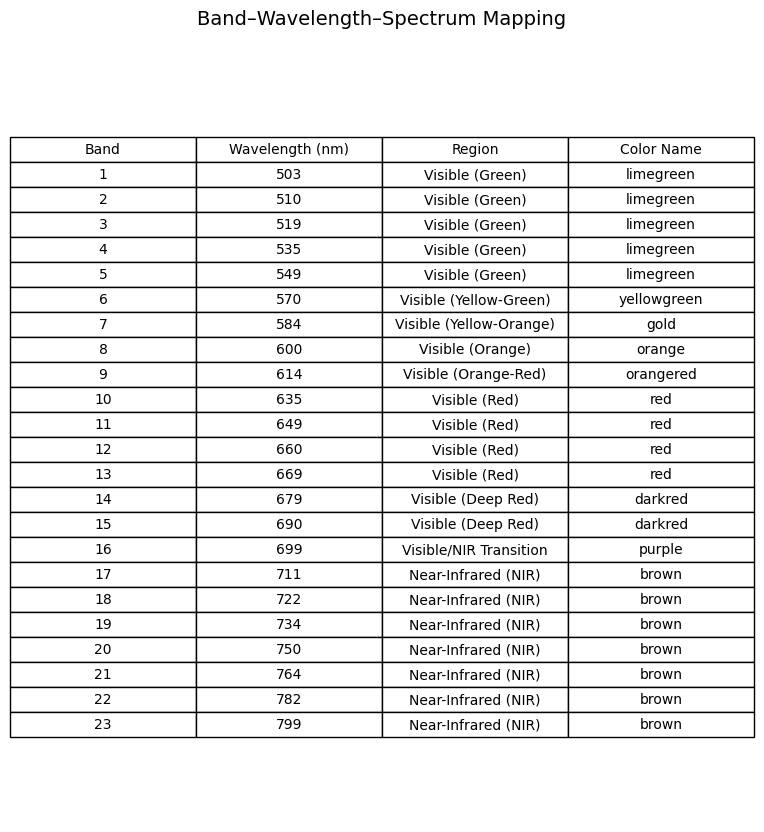
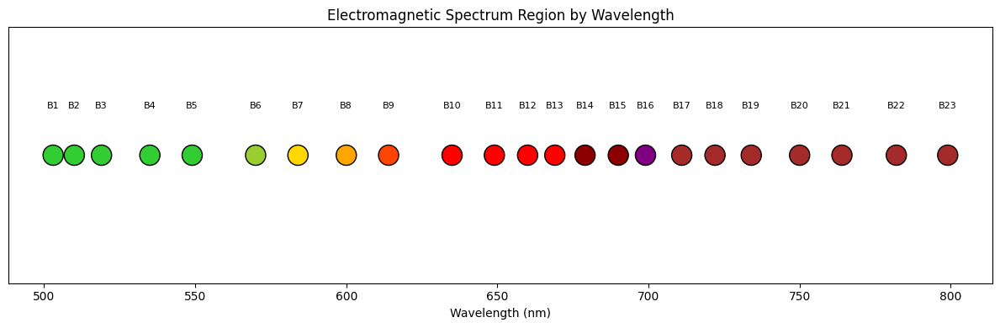

# Wyvern Satellite 23-Band Spectral Analysis

This document provides a visual and analytical overview of the 23-band multispectral data captured by the Wyvern satellite. The analysis covers the distribution of wavelengths across bands, the spectral region classification, and the corresponding visual color associations.

---

## Wavelength Distribution by Band

The bar chart below illustrates the relationship between band numbers and their corresponding wavelengths in nanometers (nm). The color of each bar represents its approximate position in the visible to near-infrared (NIR) electromagnetic spectrum.

---

## Electromagnetic Spectrum Classification

The scatter plot below shows how each band fits into the electromagnetic spectrum. Each dot represents a band and is color-coded according to its spectral region (e.g., green, red, NIR).

---

## Band-Spectrum Mapping Summary

The table below provides a summary of the band-to-wavelength mapping, including the associated spectral region and visual color name. This mapping is helpful for interpreting and visualizing multispectral imagery for remote sensing applications.

---

## 🌿 Vegetation Indices Using Wyvern Bands

### 1. NDVI – Normalized Difference Vegetation Index
**Formula:**  
`NDVI = (NIR - Red) / (NIR + Red)`

- Healthy vegetation: **0.2 – 0.8**
- Bare soil: **~0.1**
- Water: **< 0**

**Applications:**  
Crop health monitoring, drought assessment, biomass analysis.

---

### 2. EVI – Enhanced Vegetation Index  
**Formula:**  
`EVI = G × ((NIR - Red) / (NIR + C1 × Red - C2 × Blue + L))`  
*Coefficients:* G=2.5, L=1, C1=6, C2=7.5

- Better performance in high biomass or dense canopy
- Healthy vegetation: **0.4 – 0.9**

**Applications:**  
Rainforest monitoring, canopy density studies.

---

### 3. SAVI – Soil Adjusted Vegetation Index  
**Formula:**  
`SAVI = ((NIR - Red) / (NIR + Red + L)) × (1 + L)`  
*L (soil brightness factor) = 0.5*

- Useful in arid or sparsely vegetated regions  
- Sparse vegetation: **0.2 – 0.4**

**Applications:**  
Dryland agriculture, early growth stages.

---

### 4. NDWI – Normalized Difference Water Index  
**Formula:**  
`NDWI = (Green - NIR) / (Green + NIR)`

- Water bodies: **> 0.3**
- Water-stressed vegetation: **< 0.1**

**Applications:**  
Irrigation monitoring, drought detection, wetland mapping.

---

### 5. NDRE – Normalized Difference Red Edge  
**Formula:**  
`NDRE = (NIR - RedEdge) / (NIR + RedEdge)`

- Sensitive to chlorophyll and nitrogen levels  
- Healthy crops: **0.2 – 0.5**

**Applications:**  
Precision agriculture, early stress detection, crop management.

---